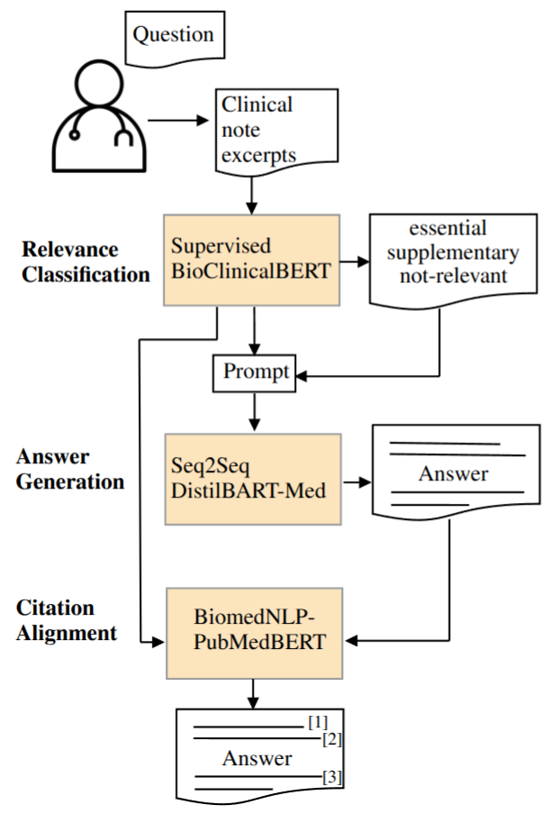

# ArchEHR-QA
This repository is the official implementation of the paper (currently under review) from the WisPerMed Team for the  BioNLP 2025 Challenge: https://archehr-qa.github.io/ 

## Abstract
Automatically answering patient questions
based on electronic health records (EHRs) requires systems that both identify 
relevant evidence and generate accurate, grounded responses. We present WisPerMed, 
a three-part pipeline developed for the ArchEHR-QA
2025 shared task. First, a fine-tuned BioClinicalBERT model classifies note sentences by
their relevance using synonym-based and paraphrased data augmentation. Second, a 
constrained generation step uses DistilBART-Med-Summary to produce faithful answers strictly
limited to top-ranked evidence. Third, we
align each answer sentence to its supporting
evidence via PubMedBERT embeddings and
ROUGE-based similarity scoring to ensure citation transparency. Our system achieved a
35.0% overall score on the hidden test set, outperforming the organizer’s baseline by 4.3%.
Gains in BERTScore (+44%) and SARI (+22%) highlight substantial improvements in semantic 
accuracy and relevance. This modular approach demonstrates that enforcing evidence-awareness and citation grounding enhances
both answer quality and trustworthiness in clinical QA systems.

## Approach
1. BioClinicalBERT classifies
note sentences as essential, supplementary, or
not-relevant, with robustness improved via
synonym and paraphrase augmentation;
2. DistilBART-Med-Summary generates an answer conditioned solely
on the top-ranked evidence and
3. PubMedBERT embeddings
align each answer sentence to its most similar
evidence, yielding explicit citations.

## Models

Models taken from Huggingface: \
Bio_ClinicalBERT: https://huggingface.co/emilyalsentzer/Bio_ClinicalBERT \
DistilBART-Med-Summary: https://huggingface.co/Mahalingam/DistilBart-Med-Summary \
PubMedBERT: https://huggingface.co/microsoft/BiomedNLP-BiomedBERT-base-uncased-abstract-fulltext 

## Installation

1. Download the ArchEHR-QA dataset from: https://physionet.org/content/archehr-qa-bionlp-task-2025 
2. Create directory "data" and copy the downloaded files there.
3. run *pip install -r requirements.txt* (you might have to install additional packages manually)

Tested with Python 3.12.9 and PyTorch 2.6.0. \
Models were trained and executed on a single Nvidia RTX4080 Super (16GB)

## Usage

Run training: *python main.py --xml_path data/dev/archehr-qa.xml --key_path data/dev/archehr-qa_key.json --test_xml_path data/dev/archehr-qa.xml --output_path results.json --train --augment --num_augmentations 4*

Run evaluation: *python evaluation/scoring.py --submission_path results.json --key_path data/dev/archehr-qa_key.json --data_path data/dev/archehr-qa.xml --out_file_path scores.json*
